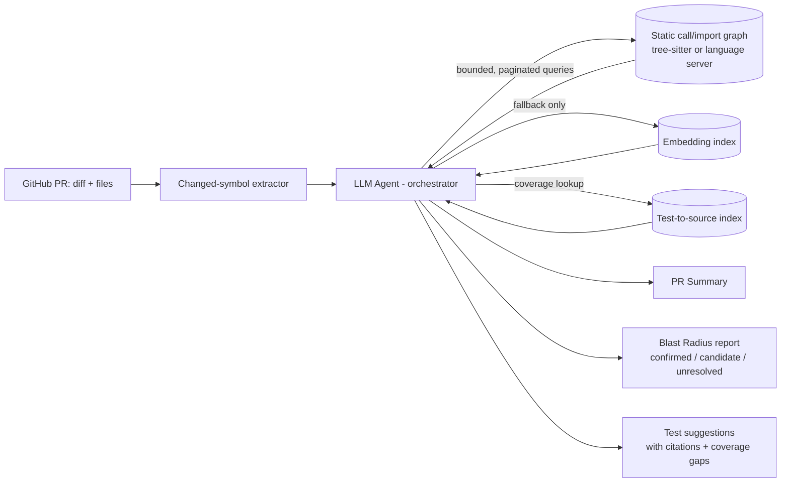

# LLM/Agent-Driven PR Blast Radius & Test Suggestion — Independent Research

Date: 2026-09-03
Scope: independent, from-first-principles research (not scoped to the existing
greenfield/catalog implementation in this repo). Answers: given a PR (e.g.
`intacct/ia-app#49987`), how to (1) summarize it, (2) compute its blast
radius, (3) suggest tests — with code/impact discovery driven by an
LLM/agent.

## 1. Problem framing

Three deliverables, each with a different "right" discovery strategy:

1. **PR summary** — needs diff + surrounding context. Cheap; LLMs do this
   well natively.
2. **Blast radius** — fundamentally a graph-reachability problem (who
   calls/imports/depends on what changed, transitively). This is where
   "LLM/agent-driven discovery" is riskiest if done naively.
3. **Test suggestions** — needs to map blast-radius nodes to existing test
   coverage and gaps, then propose new cases.

The core design question: how does the agent *discover* impact — freeform
agentic file reading, semantic/embedding retrieval, a pre-built static graph,
or some mix?

## 2. Candidate approaches

| Approach | How it works | Strengths | Weaknesses |
|---|---|---|---|
| **A. Pure agentic exploration** — LLM + shell/grep/read tools, ReAct-style, no pre-built index | Agent gets `git diff`, then freely greps/reads files, follows call chains manually | Zero upfront infra, adapts to any language/repo, good qualitative judgment | Non-deterministic, expensive (many tool calls per PR), context-window limited — silently stops exploring past a budget, can only *sample* callers, not enumerate them |
| **B. Embedding/RAG retrieval** | Chunk + embed the repo, semantic similarity search seeded by the diff | Cheap, fast, finds conceptually related code without direct call edges (copy-pasted logic, similar naming) | Similarity ≠ dependency; high false-positive/negative rate for "will this break" questions |
| **C. Static-analysis graph only, no LLM** | Build a real call/import/type graph (tree-sitter, language server, ctags); deterministic BFS/DFS reachability from changed symbols | Deterministic, reproducible, complete within its formal scope, cheap to query repeatedly | Misses dynamic dispatch, reflection, config-driven wiring, string-based references; produces a graph, not a narrative — still need something to write the summary and judge risk/tests |
| **D. Hybrid** — LLM agent orchestrates, delegates graph reachability to deterministic tools, uses embeddings only as fallback | Agent gets tool-calling access to: diff extractor, graph-query tool (bounded, paginated), semantic-search tool, test-index tool. Agent decides which changed symbols to expand, judges risk/confidence, writes summary + test suggestions from grounded evidence | Combines LLM judgment/narrative ability with graph determinism; every claim traceable to a citation (file:line, edge type); confidence tiers separate confirmed vs candidate vs unresolved | More upfront engineering (graph builder + tool layer); still needs careful budget/pagination design so the agent doesn't silently truncate |

## 3. Why not pure agentic (A), despite the "LLM/agent-driven" requirement

"LLM/agent-driven discovery" is compatible with D, not A. Pure freeform
agentic traversal has a specific, well-documented failure mode: bounded
hop/node/edge budgets (needed to keep token cost and latency sane) cause the
agent to **silently drop reachable code from the blast radius**, because it
has no way to distinguish "nothing more to find" from "I ran out of budget."
Token-output truncation on large free-form traces compounds this —
continuation/prefill workarounds for it are fragile. If reliability matters
(and "what tests do I need before merging" is exactly that), the agent needs
**structured, paginated tool calls with explicit gap-reporting**, not one
giant exploratory transcript.

## 4. Recommendation: D — tool-grounded agent over a lightweight code graph, semantic fallback, confidence-tiered output

### Design rules (non-negotiable, from prior hard-learned lessons)

- **Confidence tiers, not booleans**: `confirmed` (graph edge, cited
  file:line) / `strong_candidate` (semantic match, needs agent judgment) /
  `candidate` / `unresolved` / `unavailable` (e.g. dynamic dispatch the graph
  can't see). Never collapse these into a single yes/no.
- **Budget exhaustion is a reported state, not silence.** If hop/edge/node
  limits truncate traversal, emit an explicit gap marker so downstream
  consumers know the blast radius is a lower bound, not exhaustive.
- **Every claim needs a citation** (revision-pinned file+line or edge type) —
  makes the output auditable instead of "trust me."
- **Graph is incremental and revision-bound** — rebuilt/diffed against the
  PR's base/head SHA; never reused stale across PRs.
- **Deterministic evidence generation is separate from LLM reasoning.** The
  graph/index build is a plain deterministic pipeline (fast, testable,
  cacheable); the LLM only reasons over its outputs and decides what to
  expand / how to narrate.
- **Rank, don't dump.** Large fan-out call graphs can produce hundreds of
  candidate nodes. Prioritize by proximity (hop distance), missing test
  coverage, and (if available) historical incident correlation, so the
  output stays actionable rather than overwhelming.

## 5. Tooling choice: tree-sitter vs language server

- **tree-sitter (syntactic parse)**: fast, no build step, broad multi-language
  support, good enough for call/import edges by name resolution. Right choice
  for a first pass across a polyglot repo.
- **Language server / type-aware indexer**: precise (resolves overloads,
  interfaces, generics) but requires a working build/project index per
  language, slower cold start, more maintenance. Worth adding later as an
  **enrichment** layer for high-ambiguity languages, not the initial build.

Recommendation: start with tree-sitter for the graph; treat LSP-grade
resolution as a later precision upgrade, not a blocker.

## 6. Validation / benchmarking approach

Don't just assert the hybrid approach is better — measure it:

- Seed a small "golden set" of past merged PRs (ideally ones later linked to
  an incident or a follow-up bug-fix PR) and manually label their true blast
  radius and the tests that *should* have caught the regression.
- Run the pipeline against each PR's pre-merge state and compute recall
  (did it flag the code that later broke?) and precision (how much noise?).
- Track this over time as the graph/tool layer evolves — this is the
  feedback loop that tells you if hop/edge budgets are too aggressive or if
  the embedding fallback is pulling its weight.

## 7. Cost, latency, and caching

- Bound the agent to a fixed number of tool calls per PR (graph queries are
  cheap and paginated; the expensive part is LLM turns, not graph lookups).
- Cache the built graph per repo+revision so repeated queries within the same
  PR (or across PRs on the same commit) don't re-parse the repo.
- Keep the "summary" LLM call and the "blast radius reasoning" LLM call
  separate and cacheable independently — a diff-only summary doesn't need to
  wait on graph traversal to complete.

## 8. Data handling / security note

PR code and diffs are proprietary. Any LLM used for this pipeline should go
through the same private/enterprise model deployment already used elsewhere
in this workspace (not an arbitrary external API), with no credentials or
raw source persisted in logs or shared artifacts beyond the identity-bound
output bundle.

## 9. Build vs. buy

Products such as Greptile, CodeRabbit, Sourcegraph Cody, and Graphite already
offer PR summarization and some form of impact/coverage analysis
commercially, generally via a graph+embeddings+LLM combination. Worth
trialing one against a real `ia-app` PR to benchmark blast-radius
recall/precision before building — but for Intacct's domain-specific axes
(multi-entity/company isolation, API permission scope, entity-driven
architecture) a generic tool won't know the schema, so a thin custom graph
layer feeding a general-purpose LLM agent is likely still necessary
regardless of the vendor decision.

## 10. MVP slice

1. Diff-driven changed-symbol extraction (function/class/endpoint level, not
   just line ranges).
2. Tree-sitter-based call/import graph for touched files + bounded-hop
   neighborhood, exposed as a paginated tool.
3. Agent loop: summarize diff → query graph tool for direct callers/callees →
   tier confidence → cross-reference existing test index → propose test
   gaps.
4. Ship blast radius + test suggestions as a single evidence-bound JSON
   artifact before wiring any GitHub-write side effects (Check/comment).

### Current implementation status

Revision-bound map preparation, exact-head readiness, and PR-context seed
extraction are implemented. The adapter returns Git-authoritative changed-file
records and `hunk-enclosing-v1` candidate symbols. Definition spans are inferred
from ordered Ripwire start lines and intersected with positive-side Git hunks;
the result remains candidate navigation evidence. Ripwire callers, impact,
affected-test, co-change, and owner relationships remain canonical XML evidence
and are not yet normalized as blast-radius conclusions.

The research MVP is therefore at these boundaries:

| Capability | Status | Current boundary |
| --- | --- | --- |
| Changed-file and candidate-symbol seeds | Partial | Implemented with hunk-to-enclosing-definition attribution, explicit identity, and gap checks. |
| Callers, blast radius, and affected tests | Not implemented | Available only in retained Ripwire XML; no normalized result contract yet. |
| Agent loop and test-index cross-reference | Not implemented | No task summarization, graph-query loop, or test-index routing exists. |
| Evidence-bound blast-radius/test-suggestion JSON | Not implemented | The current normalized output is limited to PR-context seeds. |
| Aider/Ripwire/lexical bakeoff | Not run | The acceptance dataset and comparative measurements remain outstanding. |

### Live retrieval finding

The first live PR-context retrieval attempt exceeded the adapter's 300-second
timeout while Ripwire mined unbounded co-change and ownership history across
the large repository history. Cache readiness and Intacct extension routing
were not the failure. The current remediation bounds both history scans to the
latest 500 commits anchored at `HEAD`, and discloses
`history_scope="head-count"`, `history_commits`, and a `bounded_history` gap.
An isolated local PR #50176 proof now retains successful XML and normalized
evidence: hunk attribution reduced 14 file-wide definitions to the enclosing
`buildTemplateFilters` candidate and resolved all four changed hunks. This is a
local implementation proof, not evidence that onboarding is merged or broadly
available.

## 11. Repository-map context contract

The first repository-context layer is specified in
[`ia-repomap-context-contract.md`](ia-repomap-context-contract.md). It makes
the research rules operational for Intacct's `app/source` slice:

- the committed `.ia-repomap.toml` is a small machine-readable declaration;
- generated Ripwire indexes and caches are external, revision-bound artifacts;
- the exact clean PR head, explicit base, configuration, and engine identity
  must match before context is served;
- XML is retained as canonical evidence while normalized records are an
  adapter convenience;
- `candidate`, `unresolved`, `unavailable`, and truncation states remain
  explicit rather than being collapsed into a confident-looking answer.

The contract assumes that ranked symbols and static relationships are
navigation evidence. Agents must verify consequential conclusions against
source, tests, build configuration, and CI. The bakeoff acceptance criteria in
that contract are measured on Intacct examples; Ripwire's published comparison
does not substitute for that evaluation.

The implemented repository-map slice and its validation history are recorded in
the contract's [execution status](ia-repomap-context-contract.md#execution-status).
The local `ia-app` onboarding revision and a matching external prepared artifact
are now present for the named revision, but they are not merged or generally
available. Successful local PR-context evidence is retained for the isolated
PR #50176 validation revision. A local Python module interface now supports
explicit preparation and PR-context retrieval; editor, MCP, and harness wiring
remain deferred.
