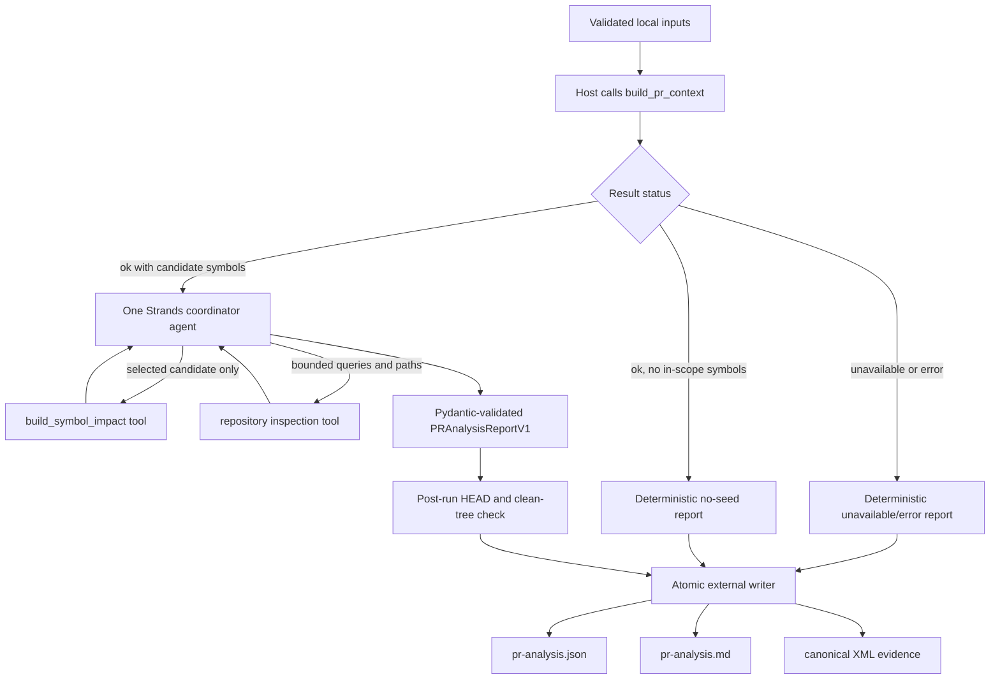
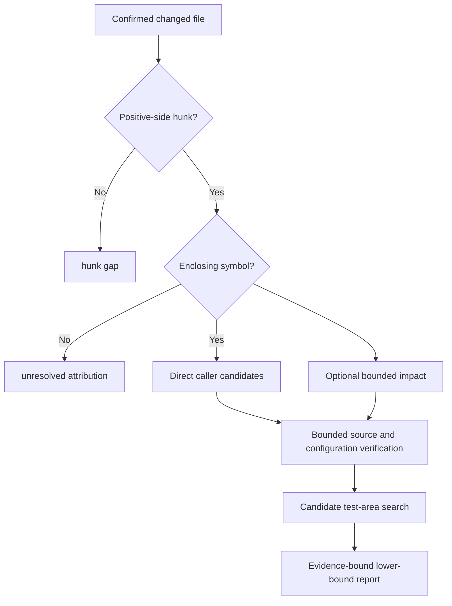

# Strands PR-analysis coordinator

Date: 2026-09-10  
Status: **Frozen v1**  
Scope: local, read-only PR analysis and lower-bound blast-radius reporting for
an exact repository checkout.

## Purpose

This document freezes the first agentic workflow built over
`ia_repomap_builder`. It produces an evidence-bound PR summary, lower-bound
blast radius, and candidate test areas without changing the target repository,
preparing an index implicitly, running tests, or publishing results.

The design follows KISS and YAGNI:

- one Strands agent, not a multi-agent system;
- existing repository-map APIs remain the evidence authority;
- deterministic host code owns readiness, sequencing, limits, persistence,
  and rendering;
- the model selects useful follow-up evidence and writes the structured
  analysis;
- no GitHub, MCP, editor, queue, memory, or test-execution integration.

V1 does not issue a merge recommendation, review verdict, severity score, or
claim of complete test coverage. Those decisions require separate evaluation
and policy.

The repository-map evidence contract remains
[`ia-repomap-context-contract.md`](ia-repomap-context-contract.md). The
research rationale remains
[`llm-agent-pr-blast-radius-research.md`](llm-agent-pr-blast-radius-research.md).

## Frozen decisions

| Decision | Frozen v1 choice |
| --- | --- |
| Framework | Strands Agents for Python |
| Model provider | Amazon Bedrock |
| Agent topology | One coordinator agent |
| Required repository state | Exact, clean local PR-head checkout |
| Index behavior | Matching external index required; never prepare implicitly |
| PR seed generation | Existing `build_pr_context()` API |
| Impact expansion | Existing `build_symbol_impact()` API, on demand |
| Repository verification | One bounded, read-only source/test inspection tool |
| Test handling | Suggest candidate areas; do not run tests |
| Machine output | Versioned JSON report |
| Human output | Markdown rendered deterministically from the JSON report |
| Persistence | External output directory only; no overwrite |
| Publication | None |

Changing a frozen choice requires a new schema or a documented v2 decision.

## Inputs

The caller supplies four values:

```text
repo_root      absolute path to the exact local PR-head checkout
base_ref       locally resolvable base commit or ref
artifact_root  absolute root containing the prepared ia_repomap index
output_dir     new external directory for this analysis
```

The coordinator accepts them as one versioned request:

```json
{
  "schema": "ia-repomap.pr-analysis-request/v1",
  "repo_root": "/path/to/exact/ia-app-checkout",
  "base_ref": "<40-character-base-sha>",
  "artifact_root": "/safe/external/ia-repomap-artifacts",
  "output_dir": "/safe/external/ia-repomap-reports/<new-run>"
}
```

All four paths or refs are supplied by the caller. Unknown keys, a different
schema, relative paths, and an existing non-empty output directory are errors.

No PR number or remote URL is accepted in v1. Resolving a hosted PR into a
checkout is an upstream responsibility.

### `repo_root`

`repo_root` must:

- be an absolute, canonical path to a Git worktree;
- have the intended PR head checked out at `HEAD`;
- have no staged, unstaged, or untracked changes;
- contain the approved root `.ia-repomap.toml`;
- contain every configured repository-map scope;
- remain unchanged for the entire run.

The caller verifies it before invocation:

```shell
git -C /path/to/ia-app rev-parse --show-toplevel
git -C /path/to/ia-app rev-parse HEAD
git -C /path/to/ia-app status --porcelain=v1
```

The last command must produce no output. The coordinator resolves the path and
repeats the revision and clean-tree checks before and after analysis.

### `base_ref`

`base_ref` must resolve locally in `repo_root` and share a merge base with
`HEAD`. A full 40-character commit SHA is recommended for repeatable runs.
A local branch or remote-tracking ref is accepted, but the report records its
resolved commit and merge base rather than trusting its mutable name.

Verify it before invocation:

```shell
git -C /path/to/ia-app rev-parse --verify '<base-ref>^{commit}'
git -C /path/to/ia-app merge-base HEAD '<base-ref>'
```

The coordinator does not fetch, pull, or resolve a GitHub PR number.

### `artifact_root`

`artifact_root` must:

- be absolute and outside `repo_root`;
- contain a manifest and non-empty Ripwire caches for the checkout's exact
  `HEAD`;
- match the repository identity, configuration digest, engine identity, and
  parser/patch identity required by the context contract;
- be readable by the coordinator process.

The caller may run the existing explicit `prepare` operation before analysis
when authorized. The coordinator never exposes preparation to the model and
never falls back to a cold build.

### `output_dir`

`output_dir` must:

- be absolute and outside `repo_root`;
- be new or empty at invocation time;
- not be an immutable Ripwire cache directory;
- be writable by the coordinator process.

A recommended layout is:

```text
<artifact-root>/reports/<repository-id>/<head-sha>/<merge-base-sha>/
```

The caller chooses the final path. The coordinator does not overwrite a prior
report.

### Bedrock runtime configuration

Bedrock configuration is operational configuration, not PR-analysis input:

```text
AWS profile or standard boto3 credential chain
AWS region
Bedrock model ID or inference-profile ID
```

Credentials are never accepted as request fields or written to reports.
The model ID and AWS region are recorded as non-secret run provenance. The
initial implementation uses a `BedrockModel` with temperature `0` and a
4,096-token response ceiling. This reduces variation but does not make model
output byte-deterministic.

Strands uses boto3 for its Bedrock provider and accepts an explicit model ID or
`BedrockModel` configuration. See the
[Strands Bedrock provider documentation](https://strandsagents.com/docs/user-guide/concepts/model-providers/amazon-bedrock/).

The current development environment uses Python 3.14 and does not yet contain
Strands. Current Strands package metadata advertises Python 3.14 support, but
implementation must still prove one pinned release in the local environment.
If that proof fails, use a dedicated supported Python environment; do not
change the repository-map runtime speculatively.

## Architecture



`build_pr_context()` runs before the model because it already owns readiness,
Git-authoritative changed files, hunk attribution, budget checks, and exact
revision validation. Making the agent call a separate readiness tool adds a
turn without adding information.

V1 constructs the request with the existing defaults:

```text
token_budget     null, so the repository declaration supplies the budget
limit            20
offset           0
history_commits  500
```

The agent receives normalized PR-context evidence without the raw XML body.
Raw XML stays in invocation memory and is persisted externally after the
post-run revision check. The model receives its digest and evidence identifier.

## Coordinator sequence

The host enforces this sequence. Prompt text is not the sequencing control.

1. Validate input paths, output location, and fixed numeric limits.
2. Call `build_pr_context()` exactly once.
3. If the result is `unavailable` or `error`, produce the matching report
   without calling Bedrock.
4. If no in-scope candidate symbol exists, produce an `ok` lower-bound report
   without calling Bedrock.
5. Create one invocation-scoped evidence session containing:
   - exact identity returned by PR context;
   - the allowed `(symbol_path, symbol_name)` candidate set;
   - counters for tool calls and impact expansions;
   - retained raw XML and its SHA-256 digest.
6. Invoke one Strands agent with the normalized PR-context seed and two tools.
7. Let the agent request bounded impact or repository evidence.
8. Require a Pydantic `PRAnalysisReportV1` response.
9. Validate every report evidence reference against the session.
10. Recheck `HEAD` and clean-tree state.
11. Render Markdown from validated JSON data.
12. Atomically write the JSON, Markdown, and raw XML evidence externally.

If step 9 or 10 fails, return `error` and do not publish a usable report.

## Model-callable tools

Only two tools are exposed to the Strands agent.

### `symbol_impact`

Input:

```text
symbol_path  exact path returned by PR context
symbol_name  exact name returned by PR context
limit        optional; fixed maximum 20
offset       optional; default 0
```

The wrapper rejects a path/name pair that is not in the current PR-context
candidate set. It invokes `build_symbol_impact()` against the same repository
and artifact roots. It returns normalized candidates, gaps, metrics, identity,
and an evidence identifier. Raw impact XML is retained outside model context.

V1 limits:

- at most five distinct symbol expansions per analysis;
- at most 20 returned rows per expansion;
- no automatic pagination;
- `has_more`, caps, ambiguity, and unresolved edges remain explicit gaps.

### `inspect_repository_evidence`

This is one read-only tool combining focused source inspection and test-area
discovery. It accepts repository-relative paths and literal search terms. It
does not execute shell supplied by the model.

Allowed discovery keys are:

- changed or impacted symbol names;
- API object or endpoint identifiers found in evidence;
- repository-relative paths;
- fixture fields found in changed source;
- error or message identifiers found in changed source.

V1 limits:

- at most eight literal search terms per call;
- at most 20 matches per term;
- at most ten files returned per call;
- at most 200 relevant lines per file;
- at most two inspection calls per analysis;
- only files beneath `repo_root` after symlink resolution;
- no writes and no test execution.

The combined ceiling is seven model-callable tool requests: five impact calls
and two inspection calls. Calls rejected by a guard still consume the relevant
budget so the model cannot retry around a limit.

Tool results provide path, line, match type, and a bounded in-memory excerpt for
reasoning. Reports persist citations and match types, not proprietary excerpts.

## Blast-radius decision flow

The word “hop” has two meanings. V1 distinguishes analysis hops from static
graph distance.

| Analysis hop | Evidence | Report treatment |
| --- | --- | --- |
| 0 | Exact head, base, merge base, configuration, engine | Confirmed identity or unavailable |
| 1 | Git changed file | `confirmed` change evidence |
| 2 | Positive-side hunk attributed to an enclosing definition | `candidate` changed symbol |
| 3 | Ripwire direct caller attached to that definition | `candidate` relationship with graph distance `1` |
| 4 | `symbol-impact-v1` reacher | `candidate` lower-bound relationship; graph distance unknown |
| 5 | Source or configuration reference, including dynamic dispatch | `candidate` source-verified relationship |
| 6 | Test, fixture, API, or error-code match | candidate test area, never executed coverage |

Ripwire does not currently expose a reliable numeric distance for every
transitive impact row. V1 therefore records graph distance only for direct
caller rows. It must not invent distances for transitive reachers.

The agent applies these decisions for each hunk-selected symbol:



Downstream callees, dynamic manager lookups, configuration wiring, owners,
co-change relationships, and affected tests are not silently promoted into
confirmed graph impact. If found through source inspection, they remain
source-verified candidates. If not inspected, the report records the gap.

## Agent instructions

The frozen system prompt must tell the single coordinator agent to:

- treat Git changed files as confirmed and all Ripwire symbols/relationships
  as candidate evidence;
- use only path/name pairs supplied by PR context for impact expansion;
- expand no more than five symbols and stop when the tool reports a cap;
- inspect source before making consequential runtime claims;
- distinguish a matching test file from executed coverage;
- report missing, ambiguous, truncated, out-of-scope, or unavailable evidence;
- avoid claims of exhaustiveness because the blast radius is a lower bound;
- produce only the `PRAnalysisReportV1` structured output.

The prompt must not ask for hidden chain-of-thought. The persisted report
contains concise conclusions and evidence references.

Strands function tools and Pydantic structured output are documented in
[Tools overview](https://strandsagents.com/docs/user-guide/concepts/tools/) and
[Structured output](https://strandsagents.com/docs/user-guide/concepts/agents/structured-output/).
The implementation uses a sequential tool executor because impact and
inspection calls depend on the current invocation's evidence state.

## Report contract

The machine report schema is:

```text
ia-repomap.pr-analysis/v1
```

Its top-level fields are:

```text
schema          exact schema string
status          ok | unavailable | error
identity        repository, head, base, merge base, config and engine identity
summary         concise purpose and behavioral change
changed_files   Git-confirmed files with hunk-selected symbols
blast_radius    evidence-bound candidate relationships
test_areas      candidate tests or behaviors; no execution claims
gaps            all known uncertainty, truncation and unavailable evidence
evidence        raw-evidence identifiers, digests and citations
agent           model ID, region, prompt version and tool-contract version
```

Each blast-radius row contains:

```text
source_path
source_symbol
target_path
target_symbol
relationship        direct_caller | transitive_reacher | source_reference
graph_distance      1 for direct caller; null otherwise
confidence          candidate | unresolved | unavailable
evidence_ids
reason
```

Each test-area row contains:

```text
area
paths
reason
confidence          candidate | unresolved | unavailable
evidence_ids
execution_status    not_run
```

The report does not use `confirmed` for static call relationships in v1.
`confirmed` is reserved for exact Git change and revision identity evidence.

## Output layout

After successful post-run validation, `output_dir` contains:

```text
output_dir/
  pr-analysis.json
  pr-analysis.md
  evidence/
    pr-context.xml
    symbol-impact-001.xml
    symbol-impact-002.xml
```

Only impact files actually requested are written. Evidence identifiers in the
report map to these relative paths and include SHA-256 digests.

The Markdown renderer is deterministic code over the validated JSON report.
The LLM does not generate a second independent Markdown narrative. The renderer
includes:

1. identity and status;
2. concise summary;
3. changed files and symbols;
4. lower-bound blast radius;
5. candidate test areas;
6. explicit gaps and evidence references.

Neither output is written inside the target checkout. No output is committed by
the coordinator.

## Status and failure rules

- `ok`: valid analysis was produced for the exact checkout. Gaps may still make
  the blast radius a lower bound.
- `unavailable`: a required prerequisite is missing or stale, including the
  checkout, marker, binary, cache, manifest, base, or merge base.
- `error`: request validation, tool execution, structured-output validation,
  evidence validation, output writing, or post-run revision checks failed.

An empty candidate set is an `ok` result with explicit scope or attribution
gaps, not proof that the PR has no impact.

The coordinator does not retry with a different index, base, model, or broader
search. It may permit the structured-output correction behavior performed by
the selected Strands release, but it does not start a second analysis run
silently.

## Security and operational boundaries

- Agent tools are read-only and scoped to the resolved checkout root.
- The model cannot choose repository root, artifact root, output directory,
  base ref, binary, cache, or model configuration.
- The model cannot invoke `prepare`, Git network operations, arbitrary shell,
  tests, package managers, GitHub writes, or filesystem writes.
- AWS credentials use the standard boto3 credential chain and are never placed
  in prompts, request objects, outputs, or logs.
- Raw XML is canonical evidence and remains external.
- Persisted reports contain citations and digests, not source excerpts or
  credentials.
- Every output is keyed to the exact analyzed revision and refuses overwrite.

## Implementation boundary

The first implementation slice should add only:

```text
ia_repomap_builder/pr_analysis.py
tests/test_pr_analysis.py
requirements-agentic.txt
docs/design/strands-pr-analysis-coordinator.md
```

`pr_analysis.py` owns the request/report models, invocation-scoped tool guards,
Bedrock-backed Strands invocation, evidence validation, deterministic Markdown
rendering, and atomic external output. Split it only if the module becomes hard
to review.

Because this repository has no tracked dependency declaration,
`requirements-agentic.txt` pins the single Strands release proven against the
runtime. Transitive dependencies remain resolver-managed. Do not modify the
ignored local `pyproject.toml` or `uv.lock` as though they were portable project
metadata.

The slice does not change Ripwire, repository-map caches, the target
repository, existing request/result contracts, or the public module CLI.

## Lightweight validation

Use fake evidence APIs and a fake Strands model for ordinary tests. No AWS call
is part of the default suite.

Tests cover:

- canonical absolute input paths and external output enforcement;
- clean exact-head and base/merge-base prerequisites;
- no Bedrock invocation for unavailable/error/no-seed results;
- one PR-context call per analysis;
- impact rejection for symbols outside the current candidate set;
- five-symbol and 20-row limits;
- bounded inspection queries, files, lines, and calls;
- preservation of all gaps, diagnostics, confidence and evidence digests;
- rejection of invented evidence identifiers or graph distances;
- post-run revision/dirty-tree failure;
- Pydantic output validation failure;
- deterministic Markdown rendering from fixed JSON;
- no overwrite and no target-repository writes;
- credentials and source excerpts absent from persisted output.

An environment-gated Bedrock smoke test may verify one synthetic repository.
It must not use proprietary source and must require explicit AWS and model
configuration.

Run the repository checks:

```shell
./.venv/bin/python -m unittest discover -s tests -p 'test_pr_analysis.py'
./.venv/bin/python -m unittest discover -s tests -p 'test_*.py'
git diff --check
rg -n '^#{1,6} ' docs/
git status --short
```

## Acceptance criteria

The first implementation is accepted when:

- an exact clean checkout with a matching index produces schema-valid JSON and
  its deterministic Markdown rendering;
- missing or stale prerequisites produce `unavailable` without a Bedrock call;
- only PR-context candidate symbols can be expanded;
- every graph and source relationship remains candidate or unresolved;
- impact and inspection limits cannot be exceeded by model requests;
- test areas always carry `execution_status="not_run"`;
- raw XML is retained byte-for-byte with matching SHA-256 evidence references;
- output is external, revision-bound, non-overwriting, and contains no source
  excerpts or credentials;
- the target checkout remains clean at the same `HEAD` after the run;
- default tests require neither AWS nor a live `ia-app` checkout.

## Iteration record

| Version | Result |
| --- | --- |
| Draft 0 | Multiple specialized agents for readiness, context, impact, verification, and synthesis. Rejected as unnecessary orchestration and state duplication. |
| Draft 1 | One Strands agent with readiness, PR-context, impact, and inspection tools. Simplified because readiness and PR-context are mandatory deterministic prerequisites. |
| Frozen v1 | Host calls PR context once; one Strands agent receives the seeds and has only bounded symbol-impact and repository-inspection tools; host validates and renders the result. |

This is the frozen v1 coordinator contract. Future repo-discovery, test
execution, hosted PR acquisition, publication, or multi-agent work belongs in
separate versions or slices.
