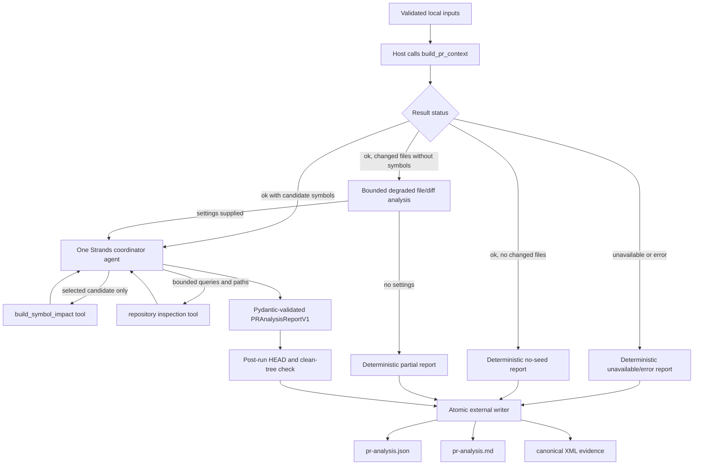
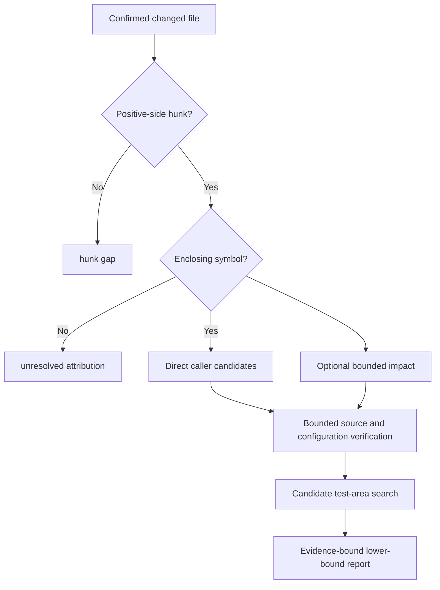

# Strands PR-analysis coordinator

Date: 2026-09-18
Status: **Frozen v1; implemented locally**
Scope: self-hosted, read-only PR review and lower-bound blast-radius reporting
for an exact repository checkout.

## Purpose

This document freezes the first self-hosted PR-review workflow built over
`ia_repomap_builder`. It resolves a canonical GitHub PR with authenticated
`gh`, uses a caller-owned local repository as the source for Git operations,
retains a detached PR worktree under an external workspace, and produces an
evidence-bound summary, lower-bound blast radius, and candidate test areas.
It does not change files in the supplied repository, execute tests, use MCP, or
publish a GitHub review.

The design follows KISS and YAGNI:

- one Strands agent, not a multi-agent system;
- existing repository-map APIs remain the evidence authority;
- deterministic host code owns readiness, sequencing, limits, persistence,
  and rendering;
- the model selects useful follow-up evidence and writes the structured
  analysis;
- GitHub CLI metadata lookup only; no GitHub write, MCP, editor, queue, memory,
  or test-execution integration.

V1 does not issue a merge recommendation, review verdict, severity score, or
claim of complete test coverage. Those decisions require separate evaluation
and policy.

The repository-map evidence contract remains
[`ia-repomap-context-contract.md`](ia-repomap-context-contract.md). The
research rationale remains
[`llm-agent-pr-blast-radius-research.md`](llm-agent-pr-blast-radius-research.md).

## Frozen decisions

| Decision | Frozen v1 choice |
| --- | --- |
| Framework | Strands Agents for Python |
| Model provider | Amazon Bedrock |
| Agent topology | One coordinator agent |
| Review entry point | Canonical GitHub PR URL plus an existing local `--repo` checkout |
| Setup behavior | Automatically prepare or reuse external state and a retained detached worktree |
| PR seed generation | Existing `build_pr_context()` API |
| Impact expansion | Existing `build_symbol_impact()` API, on demand |
| Repository verification | One bounded, read-only source/test inspection tool |
| Source-inspection authorization | Host opt-in only; disabled by default |
| Test handling | Suggest candidate areas; do not run tests |
| Machine output | Versioned JSON report |
| Human output | Markdown rendered deterministically from the JSON report |
| Persistence | External output directory only; no overwrite |
| Publication | None; report files remain in the external workspace |

Changing a frozen choice requires a new schema or a documented v2 decision.

## Self-hosted review setup

The public prerequisite and review commands are:

```shell
gh auth status

./.venv/bin/python -m ia_repomap_builder setup \
  https://github.com/owner/repository/pull/123 \
  --repo /path/to/local/repository \
  --workspace /safe/external/ia-repomap-review

./.venv/bin/python -m ia_repomap_builder review \
  https://github.com/owner/repository/pull/123 \
  --repo /path/to/local/repository \
  --workspace /safe/external/ia-repomap-review
```

`gh auth status` must show usable authentication for the PR repository. If it
does not, authenticate with `gh auth login` under the organization's policy and
rerun. The PR URL must be canonical. `--repo` must be an existing readable Git
checkout whose `origin` matches the PR repository. The command uses that
checkout for metadata and Git objects; it does not check out, reset, merge, or
edit its source files, index, current branch, `HEAD`, or working tree. It does
intentionally update Git metadata: fetched objects, `FETCH_HEAD`, and the
private `refs/ia-repomap/pr/<number>/head` ref. It also registers the retained
detached worktree under the external workspace.

Before running `review`, configure the other prerequisite groups:

- Set `RIPWIRE_SKILLS_DIR` to an external directory containing the allowlisted files
  `ripwire-change-check/SKILL.md`, `ripwire-write-tests/SKILL.md`, and
  `ripwire-orient/SKILL.md`.
- Provide Bedrock access through the standard boto3 credential chain or
  `AWS_PROFILE`, plus `AWS_REGION` or `AWS_DEFAULT_REGION` and
  `BEDROCK_MODEL_ID` in the process environment or `.env.local`.

These three external skill files are distinct from the coordinator's compact
internal profiles. The host maps them to `change_check`, `write_tests`, and
`orient` prompt guidance; the profiles do not grant tools or permissions, and
the upstream skill collection is not loaded wholesale. Do not copy skill files,
the repository marker, or internal setup into the target repository.

The command creates or reuses a clean detached PR worktree below the external
`--workspace`. The worktree is retained for reruns and human inspection. The
workspace also retains external Ripwire artifacts and report bundles. When
`--workspace` is omitted, the command uses its local user-cache default. The
workspace must be outside the supplied repository and its registered
worktrees.

The public `setup` command performs the prerequisite portion of this flow: it
resolves the PR's base and head, obtains the exact local review checkout,
prepares or reuses valid external Ripwire state, and stops before coordinator
analysis. `review` performs the same setup or reuse automatically and then
invokes the coordinator. A dirty, missing, mismatched, or unreadable retained
worktree is not silently reused. The JSON envelope reports `ok`, `unavailable`,
or `error` and includes a `remediation` list with the next user action.

The review command has no model-facing setup tool. It does not ask the model to
fetch, prepare, repair, or publish anything. Users should not copy repository
marker or agent-guidance files into the target repository for this workflow.

## Inputs

The low-level Python coordinator accepts four values after review setup:

```text
repo_root      absolute path to the exact local PR-head checkout
base_ref       locally resolvable base commit or ref
artifact_root  absolute root containing the prepared ia_repomap index
output_dir     new external directory for this analysis
```

The coordinator accepts them as one versioned request:

```json
{
  "schema": "ia-repomap.pr-analysis-request/v1",
  "repo_root": "/path/to/exact/ia-app-checkout",
  "base_ref": "<40-character-base-sha>",
  "artifact_root": "/safe/external/ia-repomap-artifacts",
  "output_dir": "/safe/external/ia-repomap-reports/<new-run>"
}
```

All four paths or refs are supplied by the caller. Unknown keys, a different
schema, relative paths, and an existing non-empty output directory are errors.

The self-hosted `review` command accepts the canonical PR URL and local
`--repo`, performs that setup, and supplies these values internally. The
step-by-step operator runbook lives in
[`ia_repomap_builder/README.md`](../../ia_repomap_builder/README.md#running-a-self-hosted-pr-review);
this document freezes the coordinator behavior and boundaries.

### `repo_root`

The review worktree used as `repo_root` must:

- be an absolute, canonical path to a Git worktree;
- have the intended PR head checked out at `HEAD`;
- have no staged, unstaged, or untracked changes;
- contain every configured repository-map scope;
- remain unchanged for the entire run.

The caller verifies it before invocation:

```shell
git -C /path/to/ia-app rev-parse --show-toplevel
git -C /path/to/ia-app rev-parse HEAD
git -C /path/to/ia-app status --porcelain=v1
```

The last command must produce no output. The coordinator resolves the path and
repeats the revision and clean-tree checks before and after analysis.

### `base_ref`

`base_ref` must resolve locally in `repo_root` and share a merge base with
`HEAD`. A full 40-character commit SHA is recommended for repeatable runs.
A local branch or remote-tracking ref is accepted, but the report records its
resolved commit and merge base rather than trusting its mutable name.
In CI or review automation, prefer the target-branch SHA supplied by the PR
event payload. Use `origin/main` only when a moving local development base is
acceptable.

Verify it before invocation:

```shell
git -C /path/to/ia-app rev-parse --verify '<base-ref>^{commit}'
git -C /path/to/ia-app merge-base HEAD '<base-ref>'
```

The coordinator does not fetch, pull, or resolve a GitHub PR number.

### `artifact_root`

`artifact_root` is an external workspace location for prepared Ripwire state. It
must:

- be absolute and outside `repo_root`;
- contain usable state for the exact review checkout;
- be readable by the coordinator process.

The self-hosted `review` command prepares or reuses this state automatically.
The coordinator never exposes preparation to the model and never substitutes
another checkout or revision.

### `output_dir`

`output_dir` must:

- be absolute and outside `repo_root`;
- be new or empty at invocation time;
- not be an immutable Ripwire cache directory;
- be writable by the coordinator process.

A recommended layout is:

```text
<artifact-root>/reports/<repository-id>/<head-sha>/<merge-base-sha>/
```

The caller chooses the final path. The coordinator does not overwrite a prior
report.

### Bedrock runtime configuration

Bedrock configuration is operational configuration, not PR-analysis input:

```text
AWS profile or standard boto3 credential chain
AWS region
Bedrock model ID or inference-profile ID
```

Credentials are never accepted as request fields or written to reports.
The model ID and AWS region are recorded as non-secret run provenance. The
loader accepts `AWS_REGION` or `AWS_DEFAULT_REGION` and `BEDROCK_MODEL_ID` from
the process environment or `.env.local`; `AWS_PROFILE` is optional. The
configured account must have access to the selected model or inference profile.
The initial implementation uses a `BedrockModel` with temperature `0` and a
2,048-token response ceiling. This reduces variation but does not make model
output byte-deterministic. The repository-map context budget is configured
separately by the repository profile.

Strands uses boto3 for its Bedrock provider and accepts an explicit model ID or
`BedrockModel` configuration. See the
[Strands Bedrock provider documentation](https://strandsagents.com/docs/user-guide/concepts/model-providers/amazon-bedrock/).

The development environment uses Python 3.14 with the pinned
`strands-agents==1.55.1` release declared in `requirements-agentic.txt`.
Default tests use fake agents and do not contact Bedrock. A live Bedrock smoke
remains optional and requires separately approved credentials, model access,
network, and cost.

## Architecture



`build_pr_context()` runs before the model because it already owns readiness,
Git-authoritative changed files, hunk attribution, budget checks, and exact
revision validation. Making the agent call a separate readiness tool adds a
turn without adding information.

### Deterministic pre-agentic returns

The host decides whether an agent invocation is permitted before constructing
Strands. These returns are deterministic and are not delegated to prompt
instructions:

1. Invalid request input returns `status="error"` with
   `phase="request_validation"`, diagnostics, and remediation. No repository
   map or model call is made.
2. A missing, stale, dirty, or mismatched checkout or artifact returns
   `status="unavailable"` with `phase="readiness"`, identity when available,
   gaps, diagnostics, and remediation. Strands is not constructed.
3. A failed PR-context invocation returns its `error` or `unavailable` status,
   with `phase="pr_context"`, diagnostics, gaps, and retained evidence
   metadata when available. Strands is not invoked.
4. A successful PR-context result with changed files but no hunk-selected
   candidate symbols may invoke one bounded Strands analysis in degraded
   file/diff mode when Bedrock settings are supplied. The report must include
   `no_candidate_symbols`, use `assessment="partial"`, and contain no
   symbol-level blast-radius rows. Without settings, it returns the same
   partial deterministic report without constructing Strands. This is not
   evidence of no impact.
5. A successful PR-context result with no changed files has no seed and does
   not construct or invoke Strands.
6. A successful result containing candidate symbols creates the symbol-seeded
   agent.

The agent seed contains only the exact identity, changed files, candidate
symbols, allowed `(symbol_path, symbol_name)` pairs, evidence identifiers, and
fixed tool limits. The model cannot choose repository or artifact roots, the
base, cache, preparation, arbitrary paths or symbols, shell commands, tests,
writes, or publication. The symbol-impact tool is available after a successful
symbol-seeded context; degraded file/diff analysis has no symbol-impact calls.
The repository inspection tool is added only when the host explicitly opts in
to bounded source inspection.

The seed and every deterministic early return use the versioned command/report
envelope. The host records the phase and preserves the distinction between
`error`, `unavailable`, an empty candidate set, and a successful candidate
set with gaps. Prompt text cannot change this branch decision.

V1 constructs the request with the existing defaults:

```text
token_budget     null, so the repository declaration supplies the budget
limit            20
offset           0
history_commits  500
response ceiling 2,048 Strands output tokens
```

The agent receives normalized PR-context evidence without the raw XML body.
Raw XML stays in invocation memory and is persisted externally after the
post-run revision check. The model receives its digest and evidence identifier.

### Allowlisted skill guidance

The review prerequisite is an external three-file allowlist under
`RIPWIRE_SKILLS_DIR`: `ripwire-change-check/SKILL.md`,
`ripwire-write-tests/SKILL.md`, and `ripwire-orient/SKILL.md`. The host reads
only those files and converts them to compact internal coordinator profiles.
Those profiles are prompt guidance, not the external file format, and grant no
tools, permissions, network access, filesystem access, or test access. Fixed
host guards remain the authority for what the agent can do.

The external files map to `change_check`, `write_tests`, and `orient`. Other
internal profile names may exist for bounded workflow routing, but they are not
additional external-file prerequisites and do not cause the upstream skill
collection to be loaded wholesale.

## Coordinator sequence

The host enforces this sequence. Prompt text is not the sequencing control.

1. Validate input paths, output location, and fixed numeric limits.
2. Call `build_pr_context()` exactly once.
3. If the result is `unavailable` or `error`, produce the matching report
   without calling Bedrock.
4. If no in-scope candidate symbol exists, produce an `ok` lower-bound report
   without calling Bedrock.
5. Create one invocation-scoped evidence session containing:
   - exact identity returned by PR context;
   - the allowed `(symbol_path, symbol_name)` candidate set;
   - counters for tool calls and impact expansions;
   - retained raw XML and its SHA-256 digest.
6. Invoke one Strands agent with the normalized PR-context seed and the
   symbol-impact tool; add bounded repository inspection only with host opt-in.
7. Let the agent request bounded impact or repository evidence.
8. Require a Pydantic `PRAnalysisReportV1` response.
9. Validate every report evidence reference against the session.
10. Recheck `HEAD` and clean-tree state.
11. Render Markdown from validated JSON data.
12. Atomically write the JSON, Markdown, and raw XML evidence externally.

If step 9 or 10 fails, return `error` and do not publish a usable report.

## Model-callable tools

Only two tools are exposed to the Strands agent.

### `symbol_impact`

Input:

```text
symbol_path  exact path returned by PR context
symbol_name  exact name returned by PR context
limit        optional; fixed maximum 20
offset       optional; default 0
```

The wrapper rejects a path/name pair that is not in the current PR-context
candidate set. It invokes `build_symbol_impact()` against the same repository
and artifact roots. It returns normalized candidates, gaps, metrics, identity,
and an evidence identifier. Raw impact XML is retained outside model context.

V1 limits:

- at most five distinct symbol expansions per analysis;
- at most 20 returned rows per expansion;
- no automatic pagination;
- `has_more`, caps, ambiguity, and unresolved edges remain explicit gaps.

### `inspect_repository_evidence`

This is one read-only tool combining focused source inspection and test-area
discovery. It accepts repository-relative paths and literal search terms. It
does not execute shell supplied by the model.

Allowed discovery keys are:

- changed or impacted symbol names;
- API object or endpoint identifiers found in evidence;
- repository-relative paths;
- fixture fields found in changed source;
- error or message identifiers found in changed source.

V1 limits:

- at most eight literal search terms per call;
- at most 20 matches per term;
- at most ten files returned per call;
- at most 200 relevant lines per file;
- at most two inspection calls per analysis;
- only files beneath `repo_root` after symlink resolution;
- no writes and no test execution.

The combined ceiling is seven model-callable tool requests: five impact calls
and two inspection calls. Calls rejected by a guard still consume the relevant
budget so the model cannot retry around a limit.

Tool results provide path, line, match type, and a bounded in-memory excerpt for
reasoning. Persisted inspection evidence contains citations and match types,
not those excerpts; model-authored narrative remains candidate evidence rather
than source authority. A no-match query emits `inspection_no_match`, and files
omitted by the ten-file cap emit `inspection_truncated`; literals visible in a
returned excerpt may be used as terms for the next bounded inspection call.

## Blast-radius decision flow

The word “hop” has two meanings. V1 distinguishes analysis hops from static
graph distance.

| Analysis hop | Evidence | Report treatment |
| --- | --- | --- |
| 0 | Exact head, base, merge base, configuration, engine | Confirmed identity or unavailable |
| 1 | Git changed file | `confirmed` change evidence |
| 2 | Positive-side hunk attributed to an enclosing definition | `candidate` changed symbol |
| 3 | Ripwire direct caller attached to that definition | `candidate` relationship with graph distance `1` |
| 4 | `symbol-impact-v1` reacher | `candidate` lower-bound relationship; graph distance unknown |
| 5 | Source or configuration reference, including dynamic dispatch | `candidate` source-verified relationship |
| 6 | Test, fixture, API, or error-code match | candidate test area, never executed coverage |

Ripwire does not currently expose a reliable numeric distance for every
transitive impact row. V1 therefore records graph distance only for direct
caller rows. It must not invent distances for transitive reachers.

The agent applies these decisions for each hunk-selected symbol:



Downstream callees, dynamic manager lookups, configuration wiring, owners, and
co-change relationships are not silently promoted into confirmed graph impact.
Ripwire per-file impact and affected-test paths are normalized as candidate
context; affected tests become deterministic `not_run` test areas, while
file-only impact cannot create symbol-level blast-radius rows. Source-inspected
relationships remain candidates, and unavailable or capped evidence remains an
explicit gap.

## Agent instructions

The implemented fixed system prompt tells the single coordinator agent to:

- treat Git changed files as confirmed and all Ripwire symbols/relationships
  as candidate evidence;
- use only path/name pairs supplied by PR context for impact expansion;
- expand no more than five symbols and stop when the tool reports a cap;
- inspect source before making consequential runtime claims;
- distinguish a matching test file from executed coverage;
- report missing, ambiguous, truncated, out-of-scope, or unavailable evidence;
- avoid claims of exhaustiveness because the blast radius is a lower bound;
- produce only the `PRAnalysisReportV1` structured output.

The prompt must not ask for hidden chain-of-thought. The persisted report
contains concise conclusions and evidence references.

Strands function tools and Pydantic structured output are documented in
[Tools overview](https://strandsagents.com/docs/user-guide/concepts/tools/) and
[Structured output](https://strandsagents.com/docs/user-guide/concepts/agents/structured-output/).
The implementation uses a sequential tool executor because impact and
inspection calls depend on the current invocation's evidence state.

## Report contract

The machine report schema is:

```text
ia-repomap.pr-analysis/v1
```

The checked-in interoperability schema is
[`schemas/ia-repomap.pr-analysis-v1.schema.json`](../../schemas/ia-repomap.pr-analysis-v1.schema.json).
The Pydantic models in `ia_repomap_builder/pr_analysis.py` are the executable
runtime contract, and `PRAnalysisRequestV1`, `PRAnalysisReportV1`, and
`run_pr_analysis` are exported from the package. The design document is
explanatory; the checked-in JSON schema is the interoperability surface.

Its top-level fields are:

```text
schema          exact schema string: ia-repomap.pr-analysis/v1
status          ok | unavailable | error
assessment      complete | partial | unavailable | error
phase           request_validation | readiness | pr_context | analysis | persistence
request         repository, base, and analysis_schema
identity        repository, head, base, merge_base, configuration_digest, engine_identity
summary         purpose, behavioral_change, and confidence
changed_files   Git-confirmed files, changes, symbols, and evidence_ids
impacted_files  candidate impacted paths, dependent_symbols, confidence, evidence_ids
blast_radius    candidate relationships and evidence_ids
test_areas      candidate areas, evidence_ids, and execution_status=not_run
gaps            known uncertainty, truncation, ambiguity, and unavailable evidence
evidence        evidence_id, kind, external relative_path, and sha256
diagnostics     host diagnostics
remediation     user-facing next actions
metrics         bounded call counts and runtime details
agent           invoked flag, model_id, region, prompt, tool, and coordinator provenance
```

Each blast-radius row contains:

```text
source_path
source_symbol
target_path
target_symbol
relationship        direct_caller | transitive_reacher | source_reference
graph_distance      1 for direct caller; null otherwise
confidence          candidate | unresolved | unavailable
evidence_ids
reason
```

Each test-area row contains:

```text
area
paths
reason
confidence          candidate | unresolved | unavailable
evidence_ids
execution_status    not_run
```

`request` and `identity` preserve exact inputs and resolved revision
provenance. `changed_files` are host-owned Git change evidence;
`impacted_files`, `blast_radius`, and `test_areas` are candidate or unresolved
navigation evidence. `diagnostics` explain the host path, `remediation`
contains caller actions, `metrics` are operational counters, and `evidence`
points to external files retained for the invocation.

The host validates the complete report before persistence. The schema string
must be exactly `ia-repomap.pr-analysis/v1`; `status` is limited to `ok`,
`unavailable`, or `error`; and `phase` is host-controlled. Every blast-radius
and test-area row requires at least one evidence identifier and a reason.
Relationship confidence is limited to `candidate`, `unresolved`, or
`unavailable`; `confirmed` is reserved for Git change and exact identity
evidence. `graph_distance` is `1` only for a direct caller and is `null` for
transitive reachers and source references. Every test-area row must carry
`execution_status="not_run"`.

Evidence identifiers must exist in the current invocation's evidence session.
Unknown fields, invented evidence identifiers, invalid enum values, missing
required fields, or collection limits exceeded by the model response produce
`status="error"`; they never produce a partially usable report. Deterministic
early returns use this same report schema: `unavailable` for missing or stale
prerequisites, `error` for validation or integrity failures, and `ok` with
explicit gaps when no candidate symbols are available. V1 deliberately does
not include severity, merge recommendation, ownership, executed coverage, or
publication state.

The report does not use `confirmed` for static call relationships in v1.
`confirmed` is reserved for exact PR metadata, revision identity, and Git
changed-file evidence. Ripwire symbols, callers, reachers, source references,
and test paths remain `candidate`, `unresolved`, or `unavailable`.

## Output layout

The external report directory contains:

```text
output_dir/
  pr-analysis.json
  pr-analysis.md
  evidence/
    pr-context.xml
    symbol-impact-001.xml
    symbol-impact-002.xml
    inspection-001.json
```

Only impact or inspection evidence files actually requested are written.
Evidence identifiers in the report point to those external files. The report
directory is retained under the self-hosted workspace and is never written
inside the target checkout.

The Markdown renderer is deterministic code over the validated JSON report.
The LLM does not generate a second independent Markdown narrative. The renderer
includes:

1. identity and status;
2. concise summary;
3. changed files and symbols;
4. lower-bound blast radius;
5. candidate test areas;
6. explicit gaps and evidence references.

Neither output is written inside the target checkout. No output is committed by
the coordinator.

## Status and failure rules

- `ok`: valid analysis was produced for the exact checkout. Gaps may still make
  the blast radius a lower bound.
- `unavailable`: a required prerequisite is missing or stale, including the
  checkout, binary, external state, base, or merge base.
- `error`: request validation, tool execution, structured-output validation,
  evidence validation, output writing, or post-run revision checks failed.

An empty candidate set is an `ok` result with explicit scope or attribution
gaps, not proof that the PR has no impact.

The coordinator does not retry with a different index, base, model, or broader
search. It may permit the structured-output correction behavior performed by
the selected Strands release, but it does not start a second analysis run
silently.

## Security and operational boundaries

- Agent tools are read-only and scoped to the resolved checkout root.
- Only host-configured, allowlisted Ripwire skill profiles may be loaded as
  compact workflow guidance. They do not add tools or permissions.
- The model cannot choose repository root, artifact root, output directory,
  base ref, binary, cache, or model configuration.
- The model cannot invoke `prepare`, Git network operations, arbitrary shell,
  tests, package managers, GitHub writes, or filesystem writes.
- The upstream Ripwire skill collection is not loaded wholesale; the bounded
  tool surface remains fixed.
- AWS credentials use the standard boto3 credential chain and are never placed
  in prompts, request objects, outputs, or logs.
- Raw XML is canonical evidence and remains external.
- Persisted inspection evidence contains citations and digests, not source
  excerpts or credentials. Model-authored narrative remains untrusted
  candidate text and must be verified against source.
- Every output is tied to the exact analyzed revision and refuses overwrite.

V1 explicitly does not execute tests or claim executed coverage. A matching
test file, affected-test path, or model suggestion is a candidate test area
only and is always emitted with `execution_status="not_run"`. V1 also does not
use MCP or expose an MCP fallback. Any test run or hosted publication is a
separate user-controlled operation.

## Implementation status and boundary

The coordinator implementation is present in:

```text
ia_repomap_builder/pr_analysis.py
ia_repomap_builder/pr_analysis_skills.py
ia_repomap_builder/pr_analysis_inspection.py
ia_repomap_builder/pr_analysis_output.py
schemas/ia-repomap.pr-analysis-v1.schema.json
tests/test_pr_analysis.py
tests/test_pr_analysis_skills.py
tests/test_pr_analysis_inspection.py
tests/test_pr_analysis_output.py
```

`pr_analysis.py` owns the request/report models, invocation-scoped tool guards,
Bedrock-backed Strands invocation, and evidence validation. The inspection and
output modules keep bounded source search and atomic external persistence
independently testable. `requirements-agentic.txt` pins the optional runtime
dependency.

Because this repository has no tracked dependency declaration,
`requirements-agentic.txt` pins the single Strands release proven against the
runtime. Transitive dependencies remain resolver-managed. Do not modify the
ignored local `pyproject.toml` or `uv.lock` as though they were portable project
metadata.

The slice does not change Ripwire, repository-map caches, the target
repository, existing request/result contracts, or add an MCP, editor, GitHub
write, publication, test-execution, or multi-agent integration. The
self-hosted `setup` and `review` commands are the local read-only acquisition
and reporting boundary.

## Lightweight validation

Use fake evidence APIs and a fake Strands model for ordinary tests. No AWS call
is part of the default suite.

Tests cover:

- canonical absolute input paths and external output enforcement;
- clean exact-head and base/merge-base prerequisites;
- no Bedrock invocation for unavailable/error/no-seed results;
- one PR-context call per analysis;
- impact rejection for symbols outside the current candidate set;
- five-symbol and 20-row limits;
- bounded inspection queries, files, lines, and calls;
- preservation of all gaps, diagnostics, confidence and evidence digests;
- rejection of invented evidence identifiers or graph distances;
- post-run revision/dirty-tree failure;
- Pydantic output validation failure;
- deterministic Markdown rendering from fixed JSON;
- no overwrite and no target-repository writes;
- credentials and source excerpts absent from persisted output.

An environment-gated Bedrock smoke test may verify one synthetic repository.
It must not use proprietary source and must require explicit AWS and model
configuration.

Run the repository checks:

```shell
./.venv/bin/python -m unittest discover -s tests -p 'test_pr_analysis.py'
./.venv/bin/python -m unittest discover -s tests -p 'test_*.py'
git diff --check
rg -n '^#{1,6} ' docs/
git status --short
```

## Acceptance criteria

The first implementation is accepted when:

- an exact clean checkout with a matching index produces schema-valid JSON and
  its deterministic Markdown rendering;
- missing or stale prerequisites produce `unavailable` without a Bedrock call;
- only PR-context candidate symbols can be expanded;
- every graph and source relationship remains candidate or unresolved;
- impact and inspection limits cannot be exceeded by model requests;
- test areas always carry `execution_status="not_run"`;
- raw XML is retained byte-for-byte with matching SHA-256 evidence references;
- output is external, revision-bound, non-overwriting, and contains no source
  excerpts or credentials;
- the target checkout remains clean at the same `HEAD` after the run;
- default tests require neither AWS nor a live `ia-app` checkout.

## Iteration record

| Version | Result |
| --- | --- |
| Draft 0 | Multiple specialized agents for readiness, context, impact, verification, and synthesis. Rejected as unnecessary orchestration and state duplication. |
| Draft 1 | One Strands agent with readiness, PR-context, impact, and inspection tools. Simplified because readiness and PR-context are mandatory deterministic prerequisites. |
| Frozen v1 | Host calls PR context once; one Strands agent receives the seeds and has only bounded symbol-impact and repository-inspection tools; host validates and renders the result. |
| Implemented v1 | The local Python coordinator now implements the frozen request, early-return, bounded-tool, post-run guard, and atomic-output boundaries. |

This is the frozen v1 coordinator contract. Future repo-discovery, test
execution, hosted PR acquisition, publication, or multi-agent work belongs in
separate versions or slices.
